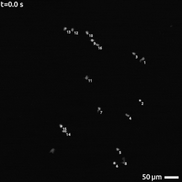

# MicroscopyLabels.jl

| **Documentation**                 | **Build Status**                                              |
|:----------------------------------|:--------------------------------------------------------------|
| [![][docs-dev-img]][docs-dev-url] | [![][status-img]][status-url] [![][travis-img]][travis-url] [![][codecov-img]][codecov-url] |

Easily embed *sane* annotations in your microscopy images. 



The reality is that you don't need this library, but it can make your life
easier if you have microscopy images and want to quickly annotate things. It
aims to be *sane* over being customizable because really it's just a wrapper
around `FreeTypeAbstraction.jl`.

## Installation

Until this package is registered, the easiest way to install is running the
following command in the Julia REPL:

```julia
] add https://github.com/tlnagy/MicroscopyLabels.jl.git
```

[docs-dev-img]: https://img.shields.io/badge/docs-dev-blue.svg
[docs-dev-url]: https://tamasnagy.com/MicroscopyLabels.jl/dev

[travis-img]: https://travis-ci.com/tlnagy/MicroscopyLabels.jl.svg?branch=master
[travis-url]: https://travis-ci.com/tlnagy/MicroscopyLabels.jl

[codecov-img]: https://codecov.io/gh/tlnagy/MicroscopyLabels.jl/branch/master/graph/badge.svg
[codecov-url]: https://codecov.io/gh/tlnagy/MicroscopyLabels.jl

[status-img]: https://www.repostatus.org/badges/latest/wip.svg
[status-url]: https://www.repostatus.org/#wip

